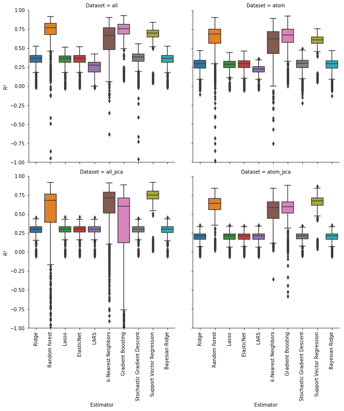

# A Predictor for the Infinite Dilution Activity Coefficient

## Summary

As part of the end of my undergraduate studies, I was required to write a bachelor thesis. I analyzed the predictive power of simple regressors from the [`scikit-learn`](https://scikit-learn.org/stable/) library in the context of chemistry - specifically, predicting the slope of a property known as the Infinite Dilution Activity Coefficient, or IDAC. The IDAC is useful in chemical engineering because it gives context to how a substance might interact with another substance in a mixture. Since a lot of the time, chemical engineering is centered around separating two substances, it's useful to know what the IDAC of those substances is. The entire thesis can be found [here](http://guidopetri.com/other/bachelor_thesis.pdf).

## Approach

This was my first big data science project, so I had a lot of trouble in the beginning. Initially, I wanted to predict water solubility directly, but this data was not available to neither me nor my professor. We tried using the [Dortmund Data Bank](http://www.ddbst.com/), but the data yielded from there would cost way too much time to clean. Instead, we used a different model called COSMO-SAC to predict the IDAC based on patches of electron clouds, and then used this data to train my models.

First, I had to engineer several features out of the data I had gotten from COSMO-SAC. A lot of these features were min/max/means of certain stats available for each electron patch or atom. I normalized this data using Yeo-Johnson, which is similar to the Box-Cox algorithm, but works for negative values too. I then removed outliers which left me with about 1700 rows of data. Out of this data, I created four datasets to work with: one containing everything, one containing only a subset of the features, and two that were the first two datasets run through a principal component analysis keeping 75% of the variability.

This data was then fed to each of the regressors I had chosen:

- Ridge
- Lasso
- LARS
- ElasticNet
- Stochastic Gradient Descent
- Support Vector Machine
- Random Forest
- Gradient Boosting
- k-Nearest Neighbors
- Bayesian

Initially, I didn't do any cross-validation simply because... I didn't know about it! I realized later that finding the optimal hyperparameters for each of these regressors required a cross-validation technique. Here too, I started out with a simple grid-based search, but then later changed to a random search across hyperparameter distributions. After 3000 samples of these hyperparameter distributions, I was confident I had gotten pretty close to finding the optimal hyperparameters for each of these regressors.

Each of the regressors was then trained on 1000 different subdivisions of the data into training/test. This gave me a distribution of scores that I could use to compare the regressors and the different sub-datasets I had used.

## Results

As it turns out, the IDAC is not a linear combination of any of the features I had engineered. This meant all the linear regressors did relatively poorly with a mean R^2 of approximately 0.3. However, the non-linear regressors did a lot better: they reached coefficients of 0.6-0.7. Unfortunately, this is not good enough to rely on for a prediction of which substances best to use, but it's a decent indicator for what order of magnitude the IDAC slope would have.

The full result set can be seen on my thesis paper above, but here is a box-and-whisker plot of the distribution of RMSE scores:

